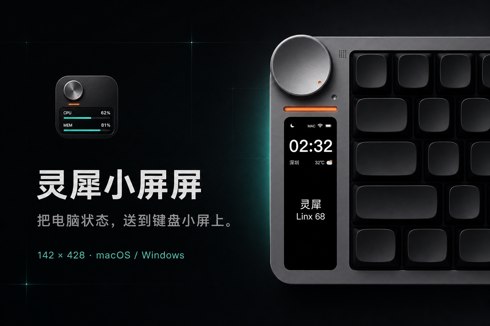
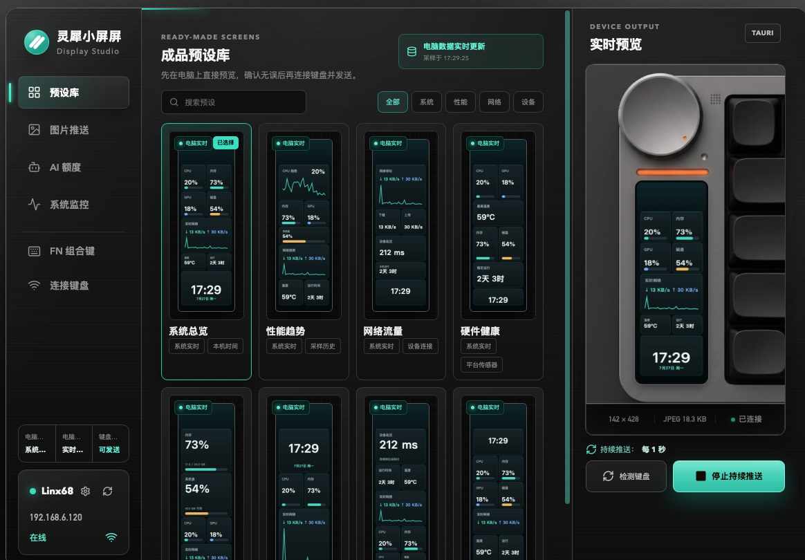
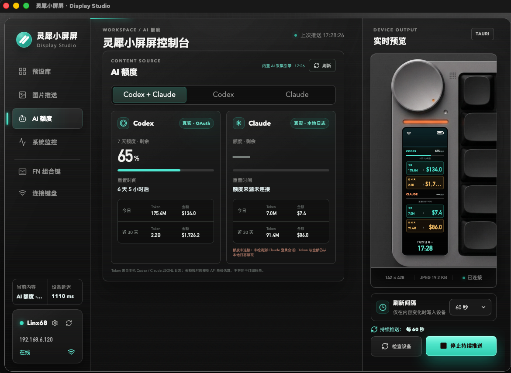

# 灵犀小屏屏 · Display Studio

一个使用 Tauri 2、Rust 和 React 构建的跨平台小屏控制工具，面向 Windows 与 macOS。

<p align="center">
  
</p>

## 当前能力

- 以 `142 × 428` 精确比例预览小屏内容。
- 导入图片、居中裁切并生成基线 JPEG。
- 展示 Codex / Claude 真实额度、当日 Token/估算金额和近 30 天 Token/估算金额，
  支持独立大字页或双服务对比页。macOS 安装包内置本地采集核心，用户无需另装 CodexBar。
- 采集 CPU、内存、系统盘、网络和温度数据；macOS 上额外采集 GPU 占用率。
  磁盘只统计系统盘（Windows 为 `%SystemDrive%`），外接硬盘不计入。
- 检测局域网设备在线状态。
- 通过 `POST /image/upload` 将 JPEG 推送至小屏。
- 保存本地模板和设备配置，支持多个键盘配置与快速切换；兼容旧版单设备配置。
- 浏览器开发模式与 Tauri 桌面模式共用同一套设备客户端。

## 技术结构

```text
React 配置界面
    ↓
142 × 428 Canvas 渲染器
    ↓
JPEG 校验与刷新调度
    ↓
Tauri Rust Command
    ↓
http://设备IP/image/upload
```

## 界面预览

主控制台用于管理预设、设备连接和实时推送；AI 额度页面集中展示 Codex / Claude 的额度与 Token 统计。

| 预设库与系统监控 | AI 额度 |
| --- | --- |
|  |  |

## 前端开发

```bash
npm install
npm run dev
```

浏览器开发服务器运行在 `http://127.0.0.1:1420`。Vite 中间件会在开发模式下代理设备检测和图片推送，避免浏览器跨域限制。

## 桌面开发

先安装 Rust 工具链和 Tauri 2 CLI，然后运行：

```bash
npm run tauri dev
```

构建安装包：

```bash
npm run tauri build
```

Windows 发布包内置 WebView2 离线安装程序，可在未预装 WebView2 或无法联网的
Windows 10 设备上完成运行环境部署。请分发 `*-setup.exe` 安装包，不要直接复制
`target/release` 下的裸可执行文件。若应用仍在创建窗口前失败，会显示错误提示并将
日志写入 `%LOCALAPPDATA%\Lingxi Display Studio\startup-error.log`。

macOS 构建会把 `src-tauri/binaries/lingxi-ai-monitor-*` 作为 Tauri sidecar
一并签名和打包。运行时优先使用内置采集核心；开发目录未准备 sidecar 时才会回退到
系统中的 `codexbar`。采集过程只读本机 Codex / Claude 的已知配置与 JSONL 日志，
不会上传认证信息或工作记录。Token 对应金额是按模型 API 单价计算的等价估算，
不等同于订阅账单。

## GitHub Release

仓库包含 `.github/workflows/release.yml`，推送与应用版本一致的 Git 标签后会自动构建并发布：

- macOS Apple Silicon（`arm64`）DMG
- macOS Intel（`x86_64`）DMG
- Windows（`x86_64`）NSIS 安装包
- 每个安装包对应的 SHA-256 校验文件

例如当前应用版本为 `0.1.2`：

```bash
git tag v0.1.2
git push origin v0.1.2
```

工作流会先创建 Release 草稿，只有 Windows 与两种 macOS 架构全部构建成功后才会公开。
macOS 安装包默认使用 ad-hoc 签名；正式分发时可在仓库 Secrets 中配置 Apple 开发者签名与公证凭据。

## 设备接口

```text
GET  http://设备IP/api
POST http://设备IP/image/upload
Content-Type: image/jpeg
```

图片限制：

- 分辨率：`142 × 428`
- 格式：基线 JPEG
- 大小：不超过 `512KB`

设备配置只保存在当前电脑的本地存储中，不会把用户的局域网 IP 上传到服务器。每个用户可以在“设置 → 当前设备”中添加并切换自己的键盘，应用会针对当前选中的 IP 执行检测和图片推送。

## 后续计划

- Windows GPU 数据采集（macOS 已通过 IOAccelerator 实现，其他平台显示「不可用」）。
- 自动发现局域网设备。
- 页面轮播和内容变化检测。
- 菜单栏、系统托盘和开机启动。
- macOS 与 Windows 正式代码签名、公证和自动更新。
